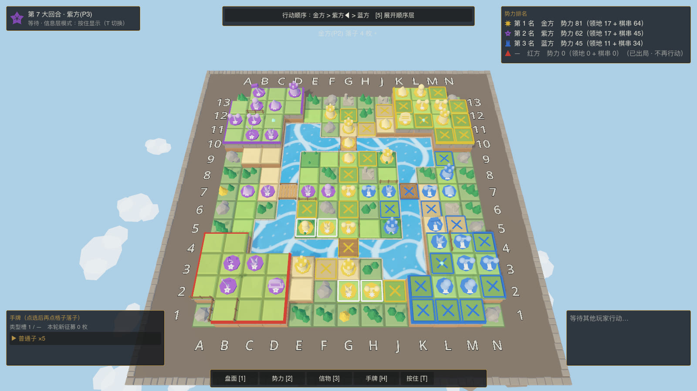

# 围杀 Siege

2–4 人共享棋盘的回合制策略构筑游戏原型：围棋式围杀、地块争夺，加上“加值 × 倍率”的成长。当前是单机人机对局，1 名玩家对 1–3 个 AI。

- 发布页：<https://siege.wws741.workers.dev>
- 下载：[macOS](https://github.com/Skysolderone/geme_demo/releases/latest/download/Siege-macos.zip) · [Windows 64 位](https://github.com/Skysolderone/geme_demo/releases/latest/download/Siege-windows-x64.zip) · [全部版本](https://github.com/Skysolderone/geme_demo/releases)



## 目录

- [下载试玩](#下载试玩)
- [怎么玩](#怎么玩)
- [从源码运行](#从源码运行)
- [工程结构](#工程结构)
- [测试](#测试)
- [发新版](#发新版)
- [文档索引](#文档索引)

## 下载试玩

免安装，解压即玩；不需要另装 .NET。两个包都没有开发者证书签名，系统第一次会拦一下。

| 系统 | 要求 | 首次打开 |
|---|---|---|
| macOS | 11 及以上（Intel 机型 10.15 及以上），Apple 芯片与 Intel 通用 | 按住 Control 点 `Siege.app`（或右键）→“打开”→ 再点“打开”。仍被拦下：系统设置 → 隐私与安全性 →“仍要打开” |
| Windows | 10 / 11，64 位，显卡支持 Vulkan | 解压整个 `Siege` 文件夹，运行 `Siege.exe`；出现“Windows 已保护你的电脑”时点“更多信息”→“仍要运行” |

Godot 4 的 C# 工程不能导出网页版，所以没有在线试玩。

## 怎么玩

一局的循环：探索信物 → 定向征募 → 批次落子 → 围杀与抢占领地 → 提升势力与先手。

- **围杀**：相连的己方棋子组成棋串、共享气；气被堵死，整串被提走。
- **势力**：领地分（独占的空格数）加全部棋串的军势；终局按势力排名。
- **构筑**：十种棋子各有分工（加值、整串乘倍率、看阵型的加成、匠人改造地形），十类信物在控制期间生效。
- **地形**：三档高度、深水与桥、林地、栅栏，以及荒漠、沼泽、岩台、浅滩，每种都改变气或覆盖的算法。

| 做什么 | 怎么做 |
|---|---|
| 开局 | 点一块出生区插旗 → 进入征募 |
| 落子 | 左下手牌选棋子类型 → 点格子暂放 → 右侧看预演 → `Enter` 整批确认 |
| 跳过 | `P` |
| 信息层 | `1` 盘面、`2` 势力、`3` 信物、`4` 顺序；`Tab` 切换盘面读法；`T` 切换按住 / 点击显示 |
| 手牌 | `H` 打开手牌面板；`V` 收起征募面板 |
| 匠人 | `E` 轮换改造目标（搭桥 / 立栅 / 烧林） |
| 视角 | 方向键或 `WASD` 平移，滚轮缩放，`M` 全局预览，空格回到自家 |
| 看对手 | 对手落子时镜头自动跟过去、轮到你再回来；`F` 开关跟随。画面上方有对手这一回合的摘要，每条棋串旁标着它的军势 |

完整规则见[设计文档](2026-09-10-siege-core-gameplay-design-v1.md)。

## 从源码运行

需要 **.NET 8 SDK** 和 **Godot 4.7.2 .NET 版**（图形版才需要 Godot）。

### 图形版

```bash
# 仓库里的 src/godot/nuget.config 指向作者 Windows 机上的本地包源；
# 在别的机器上构建时另给一份只含 nuget.org 的 NuGet 配置（否则报 NU1301）
dotnet build src/godot/Siege.Godot.csproj -p:RestoreConfigFile=<你的 nuget.config>

godot --path src/godot                                # 进选图界面
godot --path src/godot -- --map=siege-3p-board-v1     # 直接开指定地图
godot --path src/godot -- --map=board:1 --difficulty=Hard
```

- 自定义参数一律放在 `--` 之后，写成 `--名=值`；拼错会报错退出，不会悄悄用缺省值。
- Godot 在编辑器外运行读的是 Debug 程序集，改了 C# 代码要先重新 `dotnet build`。
- 换机器后第一次运行前先导入一次资源：`godot --headless --path src/godot --import`。
- 常用参数：`--map=` `--seed=` `--difficulty=` `--profile=<档案路径>` `--no-carry`（不读写带入带出档案）`--auto-demo`（无人值守自动对局）。

### 终端版

```bash
dotnet run --project src/Siege.Sim -c Release -- play --map siege-3p-board-v1 --difficulty Hard --no-carry
```

对局中输入 `resign` 弃赛，`q` 退出。不带参数运行会打印完整用法。

### 地图与难度

- 地图由互不连通的棋盘组成（一个局部战斗在一块棋盘之内）。地图标识（图形版、终端版、批量跑局共用）：内置棋盘图 `siege-4p-board-v1`（缺省）、`siege-3p-board-v1`、`siege-2p-board-v1`；随机棋盘图 `board:<种子>[:p<人数 2–4>][:n<棋盘数>]`；或一个地图 JSON 文件的路径（`Siege.Sim map --map <标识> --out <文件>` 导出）。旧地图（`siege-4p-base-v5`、双人 / 三人标准图、边疆图与 `gen:` 随机图）已删除：给这些标识会报“已删除”并退出，引用它们的旧存档与旧日志无法再加载（`analyze` 仍可分析旧日志）。
- 难度：`Easy` / `Standard` / `Hard` / `Expert`，缺省 `Standard`。

## 工程结构

```
src/
  Siege.Core/           规则内核：棋盘、棋串与气、提子、覆盖与归属、计分、征募、信物、AI。纯 C#，不依赖 Godot
  Siege.Presentation/   视图模型：把规则状态整理成界面要显示的数据（信息层、预演、演出节拍、相机）
  Siege.Sim/            命令行：终端版对局、批量跑局与分析、地图导出、日志回放
  godot/                Godot 表现层：渲染、输入与 HUD；不含任何规则计算
    scripts/            C# 脚本（BoardView 搭棋盘、LowPoly / LowPolyMesh 程序建模、TerrainParts 部件目录）
    parts/terrain/      地图部件资源（由 --export-parts 从程序建模烘出，不手改）
tests/Siege.Core.Tests/ 规则、视图模型与守门测试
docs/                   发布页（静态网页，部署在 Cloudflare）
tools/export-release.sh 导出可下载的游戏包
art/                    各次改动的截图与人工检查清单
openspec/               规格（specs/）与已归档的变更（changes/archive/）
.trellis/               开发规范（spec/）、任务归档与工作日志
```

分层约定：规则只在 `Siege.Core` 里有一份实现；`Siege.Presentation` 只做整理；Godot 层只消费视图模型。测试里有文本扫描守门，防止表现层出现第二份规则算式。

## 测试

```bash
dotnet build siege.sln            # 零警告（已开 TreatWarningsAsErrors）
dotnet test tests/Siege.Core.Tests
```

- `src/godot` 不在 `siege.sln` 里，`dotnet test` 不依赖 Godot。
- 已知情况：在 macOS（Apple 芯片）上有 11 条日志黄金哈希测试不通过，原因尚未查明；其余 2030 条通过。
- 图形版的自检：`godot --headless --path src/godot -- --auto-demo --pick-check --map=<地图>`（拾取往返检查，退出码 0 为通过）。

## 发新版

网页在 Cloudflare（Workers 静态资源，配置见 `wrangler.jsonc`），游戏包在 GitHub Releases。网页的下载按钮指向固定文件名 `Siege-macos.zip` 与 `Siege-windows-x64.zip`，所以文件名不能改，Release 也不要标成 prerelease。

```bash
tools/export-release.sh 0.3.0     # 导出两个包到 build/（不入库）
gh release create v0.3.0 build/Siege-macos.zip build/Siege-windows-x64.zip
# 改 docs/index.html 里的版本号、包大小与更新记录
npx wrangler deploy               # 更新网页
```

导出脚本只能在 macOS 上跑（要用系统 `codesign` 给应用包做临时签名），需要装好 Godot 4.7.2 .NET 与同版本的导出模板。Windows 包是交叉导出的，发版前最好在 Windows 上实际运行一次。

## 文档索引

| 文档 | 内容 |
|---|---|
| [2026-09-10-siege-core-gameplay-design-v1.md](2026-09-10-siege-core-gameplay-design-v1.md) | 完整玩法设计与变更记录（规则的权威来源） |
| [HANDOFF.md](HANDOFF.md) | 开发续接说明：现行规则速览、数据现状、已知问题、工作约定 |
| [openspec/specs/](openspec/specs/) | 各能力的规格（Requirement 与 Scenario），测试按它逐条对应 |
| [.trellis/spec/core/](.trellis/spec/core/) | 开发规范：边界与依赖、确定性、坐标、测试组织 |
| [art/map-elements-v2/README.md](art/map-elements-v2/README.md) | 地图元素部件化的改前改后对照与检查清单 |
